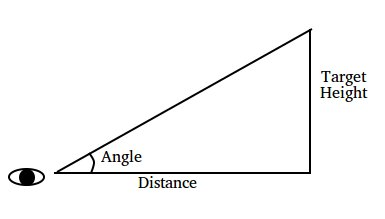

# Lesson 1

This lesson will be about how to use a processed image to find information about the position of your robot relative to the target.

We will be looking at what was done in DEStiny's year. If you want to take a look yourself, here's a [link](https://github.com/Team694/DEStiny/blob/2018-compatible/src/edu/stuy/robot/cv/StuyVision.java).

## DEStiny

In DEStiny's year, the target was a rectangle, missing a side on the top.
It was wrapped around the bottom of the high goal, which was about 7 feet above the ground and 2 feet high.
You can find a diagram of the tower [here](https://firstfrc.blob.core.windows.net/frc2016manuals/GameManual/FRC-2016-game-manual.pdf) on page 23-24.

In short terms, when CV was run, this was the sequence of events that occurred:
1. Take a picture
2. Filter the image
3. Find the largest contour in the filtered images that passes specific requirements:
    * Contour area
    * Area ratio (width / height)
4. Using a RotatedRect, return the x- and y-distance from the center of the image and the angle that the rotated rect is.
5. Using this information, calculate the distance and angle the robot needs to move to be lined up for the goal.

### Let's examine this logic.

```java
public static double frameXPxToDegrees(double px) {
    return CAMERA_VIEWING_ANGLE_X * px / CAMERA_FRAME_PX_WIDTH;
}

public static double frameYPxToDegrees(double dy) {
    return dy / CAMERA_FRAME_PX_HEIGHT * CAMERA_VIEWING_ANGLE_Y;
}
```

In `frameXPxToDegrees`, given the x-distance in pixels from the center of the frame, the viewing angle and the dimensions of the image can be used in a proportion to calculate the approximate angle that the object is at relative to the center, or 0 degrees.
This would be used as the angle that the robot would need to turn to be centered for the goal.

In `frameyPxToDegrees`, a similar process is done for the y-direction.

```java
public static double yInFrameToDegreesFromHorizon(double height) {
    return CAMERA_TILT_ANGLE - frameYPxToDegrees(height);
}
```

However, the camera was mounted at an angle that year (the value of which can be found in [RobotMap](https://github.com/Team694/DEStiny/blob/master/src/edu/stuy/robot/RobotMap.java#L99)).
This needed to be accounted for so that instead of calculating the angle from the camera's line of sight, the angle from the horizon was found.
`yInFrameToDegreesFromHorizon` does that by subtracting the calculated degrees from the tilt angle.

Now, we needed to figure out how to calculate the distance to the target.

```java
public static double findCameraDistanceToGoal(double frameY) {
    double angle = yInFrameToDegreesFromHorizon(frameY);
    return (HIGH_GOAL_HEIGHT - CAMERA_HEIGHT_FROM_GROUND) / Math.tan(Math.toRadians(angle));
}
```



Using CV to find the angle and the known values of the height of the tower relative to the camera, we had enough information to calculate the distance of the robot from the goal.
Then, after calculating this information, and using sensors and this information, when a button was pressed we would line up for a shot.

Using CV to gain information useful to the bot can seem quite difficult, but it often boils down to math.
This was true in Rafael's year as well.

## More Information

Please check updated docs for information about RotatedRect!
I have also posted about boundingRect, which may be useful in thinking about Rafael.

## Task

Here is a link to the [2017 game manual](https://firstfrc.blob.core.windows.net/frc2017/Manual/2017FRCGameSeasonManual.pdf). Look to page 38.

There are example images that were taken using our LifeCam [**here**](https://github.com/Team694/Rafael/tree/2018-compatible/images/LiftTestImages), and images provided by FIRST [**here**](https://github.com/Team694/Rafael/tree/2018-compatible/images/LED%20Peg).

Given this, think about how you could use these images to get information needed to place a gear on a peg.
Remember--the peg protrudes out of the surface where the tape is.
It is about 12 inches long.
